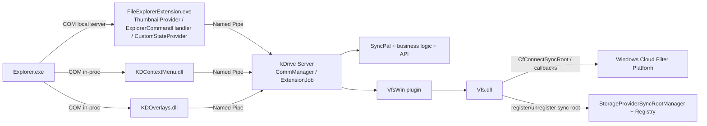

# Windows Explorer & VFS Integration Architecture (kDrive Desktop)

## Purpose

This document describes the current Windows-specific architecture for Explorer and VFS integration in the kDrive Desktop project.

It provides a clear mental model of:

- all relevant shell-extension binaries
- their responsibilities and runtime usage
- `FileExplorerExtension.exe` role and interactions
- IPC and dependency directions
- end-to-end runtime flows

---

## 1. High-Level Architecture

The Windows integration layer is split into two families:

1. **CFAPI / LiteSync integration (modern Cloud Files path)**
   - `Vfs.dll`
   - `FileExplorerExtension.exe`
2. **Standard shell integration (legacy / non-CFAPI path)**
   - `KDContextMenu.dll`
   - `KDOverlays.dll`

The **kDrive server process** (`src/server`) is the central orchestrator for business logic, sync state, VFS coordination, and API-backed actions.

---

## 2. Binaries and Responsibilities

## 2.1 `Vfs.dll`

- **Location:** `extensions/windows/cfapi/Vfs`
- **Type:** Native DLL with exported C API (`vfsInit`, `vfsStart`, `vfsStop`, ...)
- **Used by:** Windows VFS plugin in server (`src/server/vfs/win/vfs_win.cpp`)

### Purpose
Backend bridge between kDrive server and Windows Cloud Files API (CFAPI).

### Responsibilities
- Register/unregister sync roots with Windows (`StorageProviderSyncRootManager`)
- Connect/disconnect CFAPI callbacks (`CfConnectSyncRoot` / `CfDisconnectSyncRoot`)
- Placeholder operations (create/convert/revert/update)
- Hydration/dehydration operations
- Pin state and transfer updates

### Where used
Loaded via server-side Windows VFS plugin (`VfsWin`) when sync is in `VirtualFileMode::Win`.

---

## 2.2 `FileExplorerExtension.exe`

- **Location:** `extensions/windows/cfapi/FileExplorerExtension`
- **Type:** Local COM server executable (out-of-proc)
- **Declared in:** `extensions/windows/cfapi/FileExplorerExtensionPackage/Package.appxmanifest`

### Purpose
Hosts Explorer Cloud Files COM handlers required by modern File Explorer integration.

### Responsibilities
- Exposes `ThumbnailProvider` for offline placeholders
- Exposes `ExplorerCommandHandler` for CloudFiles context menu verbs
- Exposes `CustomStateProvider` (currently minimal implementation)
- Communicates with kDrive server via named pipe for menu data/actions and thumbnails

### Where used
Activated by Explorer via COM when interacting with Cloud Files-integrated items.

---

## 2.3 `KDContextMenu.dll`

- **Location:** `extensions/windows/standard/KDContextMenu`
- **Type:** In-proc shell extension (`IContextMenu`)

### Purpose
Provides classic context menu integration for standard mode.

### Responsibilities
- Fetch menu title/items from server (`GET_STRINGS`, `GET_MENU_ITEMS`)
- Send selected actions to server (`COPY_PUBLIC_LINK`, `COPY_PRIVATE_LINK`, etc.)

### Where used
Legacy / non-CFAPI Explorer integration path.

---

## 2.4 `KDOverlays.dll`

- **Location:** `extensions/windows/standard/KDOverlays`
- **Type:** In-proc shell icon overlay extension (`IShellIconOverlayIdentifier`)

### Purpose
Displays sync status overlays in Explorer.

### Responsibilities
- Query and cache file status via `RemotePathChecker`
- Consume server push updates (`STATUS`, `BROADCAST`)
- Trigger shell refresh notifications (`SHChangeNotify`)

### Where used
Legacy / standard Explorer overlay flow.

---

## 2.5 Server-side Windows VFS plugin (`VfsWin`)

- **Location:** `src/server/vfs/win`
- **Type:** Runtime-loaded VFS plugin implementing `KDC::Vfs`

### Purpose
Server abstraction layer that maps generic VFS operations to Windows CFAPI backend (`Vfs.dll`).

### Responsibilities
- Initialize/start/stop VFS backend
- Execute file lifecycle operations (placeholder, hydrate, dehydrate, status)
- Connect server callbacks for sync state and transfer control

### Where used
Instantiated by `createVfsFromPlugin` when Windows VFS mode is selected.

---

## 3. Why `FileExplorerExtension.exe` Exists

`FileExplorerExtension.exe` exists because the Cloud Files handlers are registered as **COM ExeServer classes** (out-of-proc), not as in-proc shell DLL classes.

This design enables:

- modern CloudFiles integration endpoints required by Windows manifest model
- process isolation from the main server process
- a dedicated COM host for thumbnail/menu/custom-state handlers

It serves as a shell-facing adapter that forwards runtime requests to the server over named pipes.

---

## 4. Communication Model

## 4.1 IPC / API mechanisms

- **COM (out-of-proc):** Explorer ↔ `FileExplorerExtension.exe`
- **COM (in-proc):** Explorer ↔ `KDContextMenu.dll`, `KDOverlays.dll`
- **Named pipes:** extension binaries ↔ kDrive server (`\\.\pipe\<app>-<user>`)
- **CFAPI callbacks:** Windows Cloud Filter platform ↔ `Vfs.dll`
- **Registry operations:** sync root and namespace/navigation registration

## 4.2 Dependency direction (consumer → provider)

- Explorer → `FileExplorerExtension.exe`
- Explorer → `KDContextMenu.dll`
- Explorer → `KDOverlays.dll`
- `FileExplorerExtension.exe` → kDrive server (pipe)
- `KDContextMenu.dll` → kDrive server (pipe)
- `KDOverlays.dll` → kDrive server (pipe)
- kDrive server (`VfsWin`) → `Vfs.dll`
- `Vfs.dll` → Windows CFAPI + `StorageProviderSyncRootManager`
- kDrive server → SyncPal / API / business logic

---

## 5. Runtime Flows

## 5.1 Placeholder file open (hydration)

1. User opens an online-only file in Explorer.
2. Windows CFAPI triggers `onFetchData` callback in `Vfs.dll`.
3. `Vfs.dll` sends `MAKE_AVAILABLE_LOCALLY_DIRECT` to server via pipe.
4. Server (`ExtensionJob`) schedules a direct download job through SyncPal.
5. Server updates transfer progress back through VFS layer.
6. `Vfs.dll` pushes transferred data with `CfExecute(TRANSFER_DATA)`.
7. Hydration completes; file becomes locally available.

## 5.2 CloudFiles context menu (modern Explorer menu)

1. Explorer queries commands from `ExplorerCommandHandler` in `FileExplorerExtension.exe`.
2. Extension requests `GET_ALL_MENU_ITEMS` from server.
3. Server computes actions using sync state, VFS mode, permissions, and file metadata.
4. Explorer renders returned commands.
5. User action is sent back via pipe to server command handlers.

## 5.3 Thumbnail retrieval for offline placeholder

1. Explorer calls `ThumbnailProvider::GetThumbnail`.
2. Extension checks placeholder/offline context and MIME eligibility.
3. Extension requests `GET_THUMBNAIL` from server.
4. Server fetches thumbnail content and returns base64 BMP payload.
5. Extension decodes payload and creates `HBITMAP` for Explorer.

---

## 6. Supporting Windows Integration Modules

- **`NavigationPaneHelper` (`src/server/navigationpanehelper.cpp`)**
  - maintains navigation pane / namespace registry setup
  - handles legacy key updates for non-Win VFS mode

- **`CommManager`, `ExtCommServer`, `PipeCommServer` (`src/server/comm/*`)**
  - central extension communication server
  - command dispatch to `ExtensionJob`

- **`IoHelper_win.cpp` (`src/libcommonserver/io/iohelper_win.cpp`)**
  - Windows file-system helpers used by server logic

---

## 7. Logical Text Diagram

```mermaid
flowchart LR
    EX["Explorer.exe"] -->|COM local server| FEX["FileExplorerExtension.exe\nThumbnailProvider / ExplorerCommandHandler / CustomStateProvider"]
    EX -->|COM in-proc| KCM["KDContextMenu.dll"]
    EX -->|COM in-proc| KOV["KDOverlays.dll"]

    FEX -->|Named Pipe| SRV["kDrive Server\nCommManager / ExtensionJob"]
    KCM -->|Named Pipe| SRV
    KOV -->|Named Pipe| SRV

    SRV --> CORE["SyncPal + business logic + API"]
    SRV --> VWIN["VfsWin plugin"]
    VWIN --> VDLL["Vfs.dll"]

    VDLL -->|CfConnectSyncRoot / callbacks| CFAPI["Windows Cloud Filter Platform"]
    VDLL -->|register/unregister sync root| SRM["StorageProviderSyncRootManager + Registry"]
```

---

## 8. Practical Mental Model

- The **server process is the control plane** (state, permissions, links, downloads, thumbnails).
- Shell extensions are **presentation/bridge adapters** for Explorer integration.
- `Vfs.dll` is the **CFAPI backend adapter** and callback endpoint.
- `FileExplorerExtension.exe` is the **modern CloudFiles COM host** that translates shell requests to server commands.
- **Named pipe IPC** is the primary runtime channel between shell integration binaries and kDrive server.

---

## 9. MSIX Packaging and Deployment

`FileExplorerExtension.exe` and its CloudFiles handlers are shipped in a sparse MSIX bundle
(`FileExplorerExtensionPackage_<version>_x64_arm64.msixbundle`) installed under
`$INSTDIR\shellext\AppX`.

### AUMID and package family

Windows links a sync root to the package that provides its Explorer integration through the
`AUMID` value of `HKLM\SOFTWARE\Microsoft\Windows\CurrentVersion\Explorer\SyncRootManager\<syncRootId>`,
written by `CloudProviderRegistrar::registerWithShell()`
(`extensions/windows/cfapi/Vfs/cloudproviderregistrar.cpp`) as
`Infomaniak.kDrive.Extension_<publisherId>!App`.

`<publisherId>` is a hash of the *subject of the signing certificate*, so **changing the
certificate changes the package family**. Windows cannot update a package in place across package
families, and the consequences differ from one Windows version to the other:

- **Windows 11**: both packages are installed side by side. The next kDrive start migrates the sync
  roots to the new extension, the stale package simply stays behind.
- **Windows 10**: installing the new package *fails*, because two packages sharing the same name
  but having a different publisher id cannot coexist on the machine. The next kDrive start still
  migrates the sync roots to the new extension, which is not installed, and the Explorer
  integration breaks.

Removing the packages belonging to the other families before deploying the new one avoids both
situations.

### What the installer does

The NSIS installer and uninstaller drive `admin/win/shell-extension-setup.ps1`. The script is
embedded in the installer, extracted to `$PLUGINSDIR` when needed and run elevated: it is never
deployed on the user machine and is not meant to be started manually.

| Mode | When | Action |
| --- | --- | --- |
| `Install` | First installation and update | Removes the extension packages signed with another certificate, then provisions the bundle. |
| `Uninstall` | Full uninstallation only | Removes every kDrive extension package, whatever the certificate it was signed with. |
| `RestartExplorer` | Right after `Install` or `Uninstall` | Stops the Explorer process of the current session so that it unloads the packages that were just removed or replaced. |

The two modes treat the sync roots differently, because placeholders must survive an update but
have to disappear on an uninstallation:

- On **install**, the `AUMID` of the kDrive sync roots is cleared before the stale packages are
  removed. This detaches them from the package so Windows does not tear the sync roots down with
  it, leaving the placeholders (i.e. the user files) untouched. The installer does not restore the
  value: kDrive points the sync roots at the extension it expects on its next start.
- On **uninstall**, the sync roots are left attached, so that Windows removes them — and the
  placeholders they contain — along with the extension.

A silent uninstallation is the update path (the installer runs the previous `Uninstall.exe /S`),
and it does not run the script at all: only an interactive uninstallation removes the extension.

Explorer keeps the DLLs of the packages it loaded: the `RestartExplorer` mode stops the Explorer
process of the current session right after the extension has been deployed or removed, so that it
unloads them. Windows restarts the shell right away and the script relaunches it if that automatic
restart is disabled; other sessions pick the change up when their user logs on. A stale Explorer
being only cosmetic, every failure of this mode is logged as a warning and never fails the
installation or the uninstallation.

The bundle is **provisioned** (`Add-AppxProvisionedPackage -Online -SkipLicense`) rather than
installed, so that every user of the computer gets the extension. A provisioned package is only
registered for a user when he logs on, so the installer additionally registers it for the user
running it (`Add-AppxPackage`, run unelevated through `UAC_AsUser_ExecShell`).
