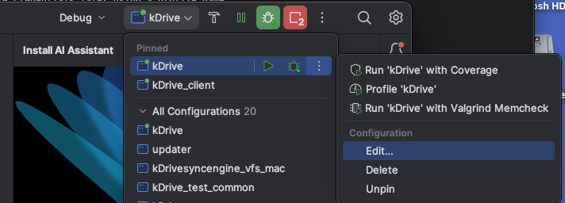
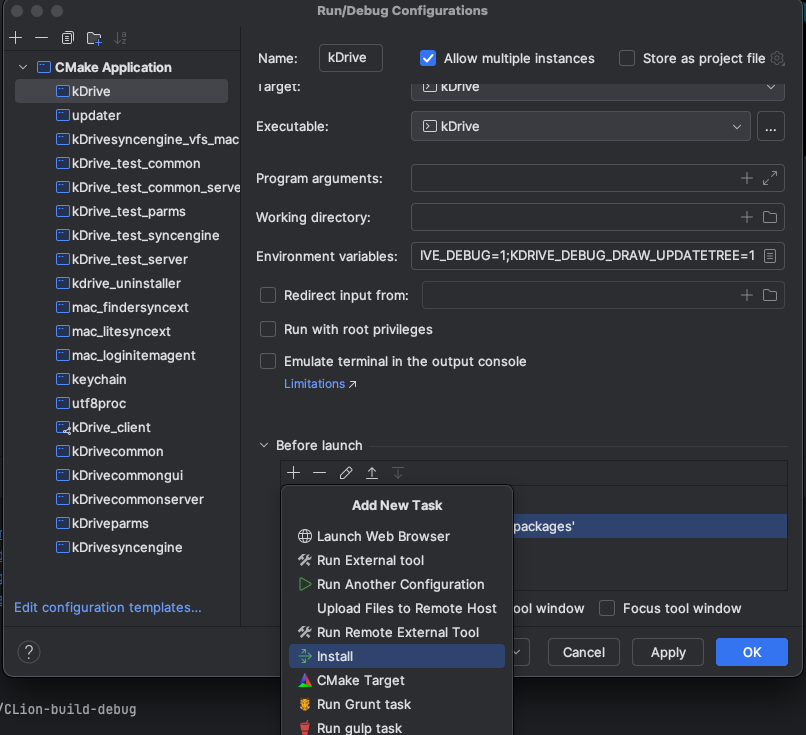
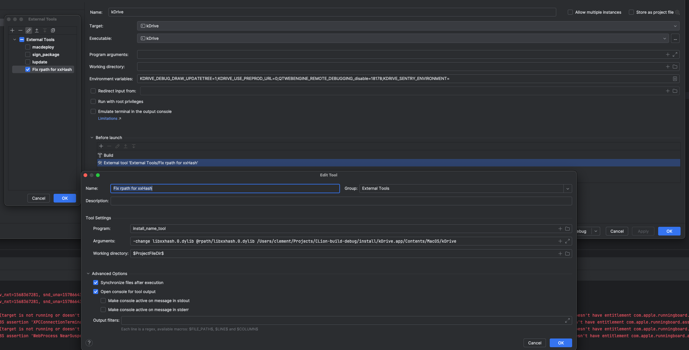
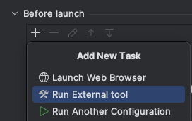
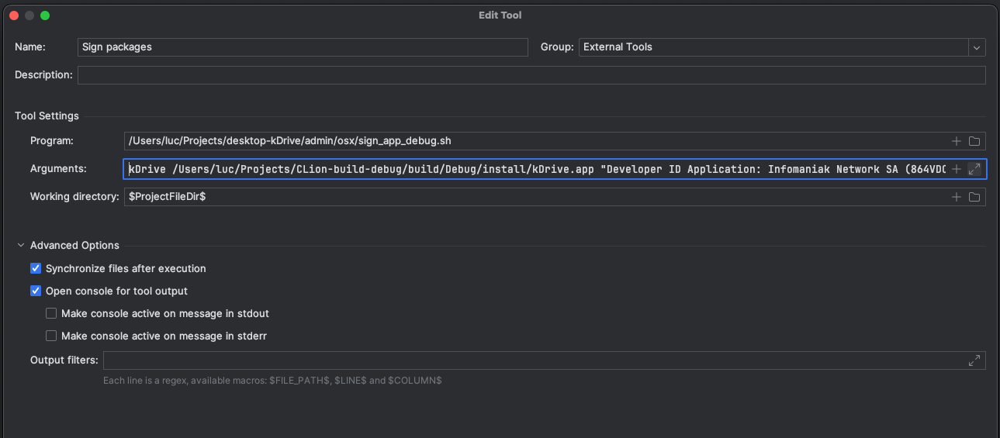

# kDrive Desktop Configuration - MacOS

- [kDrive files](#kdrive-files)
- [Installation Requirements](#installation-requirements)
	- [SIP](#sip)
	- [Xcode](#xcode)
	- [cppunit](#cppunit)
	- [Poco](#poco)
	- [libzip](#libzip)
	- [Sparkle](#sparkle)
	- [Packages](#packages)
	- [Notarytool](#notarytool)
	- [Conan](#conan)
- [Build in Debug](#build-in-debug)
	- [Using CLion](#using-clion)
        - [CMake Parameters](#cmake-parameters)
		- [Run CMake install](#run-cmake-install)
		- [Sign package](#sign-package)
	- [Using Qt Creator](#using-qt-creator)
		- [Qt Configuration](#qt-configuration)
- [Build in Release](#build-in-release)
	- [Requirements](#requirements)
	- [Build](#build)
- [Disabling the SIP in VMWare Fusion](#disabling-sip-in-vmware-fusion)

# kDrive files

The directory `~/Projects` will be used for the installation in this documentation.  
If you wish to have the sources elsewhere, feel free to use the path you want.

```bash
cd ~/Projects
git clone https://github.com/Infomaniak/desktop-kDrive.git
cd desktop-kDrive && git submodule update --init --recursive
```

# Installation Requirements

We are migrating the dependency management from manually to using conan.
Currently, only the dependency `xxHash` is managed by conan. See [Conan](#conan) for more information.

## SIP

With some VM software, it isn't possible to boot in recovery mode after the initial installation (ex: VMWare Fusion, Parallels Desktop).  
Therefore, you need to [disable the SIP](https://developer.apple.com/documentation/security/disabling_and_enabling_system_integrity_protection) as soon as possible in the initial setup of macOS.  
If you forgot to disable it and your VM is using VMWave Fusion, see [this section](#disabling-sip-in-vmware-fusion) to disable it.

## Xcode

Xcode is required to build this project on MacOs, if you do not have it installed, you can download it from the App Store.  
Once installed, run the following command :

```bash
sudo xcode-select -s /Applications/Xcode.app/Contents/Developer
```

## CPPUnit

Download and build `CPPUnit`:

You will probably need to install `automake` and `libtool`:
```
brew install automake
brew install libtool
```

CPPUnit must be build in single architecture. Replace with `x86_64` or `arm64` in the following command:
```bash
cd ~/Projects
git clone git://anongit.freedesktop.org/git/libreoffice/cppunit
cd cppunit
./autogen.sh
./configure CXXFLAGS="-arch <your_arch> -mmacosx-version-min=10.15"
make
sudo make install
```

If the server does not reply to the `git clone` command, you can download the source from https://www.freedesktop.org/wiki/Software/cppunit/.

## Poco

> :warning: **`Poco` requires OpenSSL to be installed.**
>
> You **must follow** the [Conan](#conan) section first to install `OpenSSL`.

Download and build `Poco`:

```bash
cd ~/Projects
source "$(find ./desktop-kdrive/ -name "conanrun.sh")" || exit 1 # This will prepend the path to the conan-managed dependencies to the 'DYLD_LIBRARY_PATH' environment variable
git clone https://github.com/pocoproject/poco.git
cd poco
git checkout tags/poco-1.13.3-release
mkdir build
cd build
cmake .. -DCMAKE_OSX_ARCHITECTURES="x86_64;arm64" -DCMAKE_OSX_DEPLOYMENT_TARGET="10.15" -DENABLE_DATA_ODBC=OFF 
sudo cmake --build . --target install
```

## libzip

> :warning: because the cmake builds in multi-architecture, `libzip` and its dependencies (in this case `zstd` must be installed in multi-architecture as well).

Install `zstd` for multi-architecture:
```bash
cd ~/Projects
curl -o zstd-1.5.6.tar.gz -L https://github.com/facebook/zstd/archive/v1.5.6.tar.gz
tar xzf zstd-1.5.6.tar.gz
mkdir -p zstd-1.5.6/build/cmake/build && cd zstd-1.5.6/build/cmake/build
cmake -DCMAKE_BUILD_TYPE=Release -DCMAKE_OSX_ARCHITECTURES="arm64;x86_64" -DCMAKE_OSX_DEPLOYMENT_TARGET="10.15" ..
cmake --build . --config Release
sudo cmake --build . --config Release --target install
```

Clone and install `libzip`:
```bash
cd ~/Projects
git clone https://github.com/nih-at/libzip.git
cd libzip
git checkout tags/v1.10.1
mkdir build && cd build
cmake -DCMAKE_OSX_ARCHITECTURES="arm64;x86_64" -DCMAKE_OSX_DEPLOYMENT_TARGET="10.15" -Dzstd_SHARED_LIBRARY="/usr/local/lib/libzstd.1.5.6.dylib" -Dzstd_INCLUDE_DIR="/usr/local/include" ..
make
sudo make install
```

## Sparkle

Download [Sparkle](https://github.com/sparkle-project/Sparkle/releases/tag/2.6.4) version `2.6.4` and copy the `Sparkle` directory in `~` and name it `Sparkle`.  
Copy and paste `Sparkle.framework` in `~/Library/Frameworks` (create this directory if needed).

## Packages

Install [Packages](http://s.sudre.free.fr/Software/Packages/about.html).

## Notarytool

Access [Apple account manager](https://appleid.apple.com/account/manage) and click on `Generate password`
Enter `notarytool` as application name.
Copy the previously generated password to use in the command below:

```bash
xcrun notarytool store-credentials "notarytool" --apple-id <email address> --team-id [team-id] --password <password>
```
---

## Conan
The recommended way to install Conan is via **pip** within a Python virtual environment (Python 3.6 or newer). This approach ensures isolation and compatibility with your project’s dependencies.

> **Tip:** Other installation methods (system packages, pipx, installer scripts, etc.) are also supported. See [Conan Downloads](https://conan.io/downloads) for the full list of options.
### Prerequisites
- **Python 3.6+**
- **pip** (upgrade to the latest version):
  ```bash
  pip install --upgrade pip
  ```

### 1. Create and Activate a Virtual Environment
1. Create a virtual environment in `./.venv`:
   ```bash
   python3 -m venv .venv
   ```
2. Activate the virtual environment:
   ```bash
   source .venv/bin/activate
   ```

### 2. Install Conan

With the virtual environment active, install Conan:
```bash
pip install conan
```

Verify the installation:
```bash
conan --version
```
You should see an output similar to:
```
Conan version 2.x.x
```

---

### 3. Configure a Conan Profile
1. Auto-generate the default profile:
   ```bash
   conan profile detect
   ```
   This creates `~/.conan2/profiles/default`.

2. Open `~/.conan2/profiles/default` and customize the settings under the `[settings]` section. For example, to target macOS with C++20:
   ```ini
   [settings]
   os=Macos
   arch=armv8
   compiler=apple-clang
   compiler.version=16
   compiler.cppstd=20
   compiler.libcxx=libc++
   build_type=Debug
   ```

---

### 4. Configure CMake Toolchain Injection
The project requires additional CMake variables for a correct build. To inject these, create a file named `debug_vars.cmake` in your profiles directory (`~/.conan2/profiles`), and then reference it in the profile under `[conf]`:

1. Create or open `~/.conan2/profiles/debug_vars.cmake` and add the cache entries, for example:
   ```cmake
   set(APPLICATION_CLIENT_EXECUTABLE "kdrive_client")
   set(KDRIVE_THEME_DIR "$ENV{HOME}/Projects/desktop-kDrive/infomaniak")
   set(BUILD_UNIT_TESTS "ON")      # Set to "OFF" to skip tests
   set(SOCKETAPI_TEAM_IDENTIFIER_PREFIX "864VDCS2QY")
   set(CMAKE_INSTALL_PREFIX "$ENV{HOME}/Projects/CLion-build-debug/build/Debug/install")
   ```

2. In your profile (`~/.conan2/profiles/default`), add under a new `[conf]` section:
   ```ini
   [conf]
   tools.cmake.cmaketoolchain:user_toolchain+={{profile_dir}}/debug_vars.cmake
   ```


### 5. Configure the Release Profile (Optional)

1. To build a release version using the script `./infomaniak-build-tools/macos/build-release.sh`, you must create a profile named `infomaniak_release`.
   This profile must not contain a `tools.cmake.cmaketoolchain:user_toolchain` section, must use `armv8|x86_64` as `arch`, and set `build_type` to `Release`.
2. Create the profile by running:
    ```bash
    cat << EOF > ~/.conan2/profiles/infomaniak_release
    [settings]
    os=Macos
    arch=armv8|x86_64
    compiler=apple-clang
    compiler.cppstd=gnu20
    compiler.libcxx=libc++
    compiler.version=16
    build_type=Release
   EOF
    ```
   You can adjust the `compiler` settings if needed.

---

### 6. Install Project Dependencies

**From the repository root**, run the provided build script, specifying the desired configuration (`Debug` or `Release`) and the folder where the app will be builded.
```bash
./infomaniak-build-tools/conan/build_dependencies.sh [Debug|Release] [--output-dir=<output_dir>] [--make-release] [--help] 
```

> **Note:** Currently only **xxHash**, **log4cplus**, **OpenSSL** and **libzip** are managed via this Conan-based workflow. Additional dependencies will be added in future updates.

---
# Build in Debug

## Deploying dependencies

Dependencies are deployed using utilitary tool `macdeployqt` provided with the Qt binaries:

```bash
$(source $HOME/Projects/desktop-kDrive/infomaniak-build-tools/conan/common-utils.sh && find_qt_conan_path $HOME/Projects/CLion-build-debug qt)/bin/macdeployqt $HOME/Projects/CLion-build-debug/install/kDrive.app -libpath=$DYLD_LIBRARY_PATH -no-strip -executable=$HOME/Projects/CLion-build-debug/install/kDrive.app/Contents/MacOS/kDrive
```

This command is run each time we build. However, since it takes some time to find all dependencies, it is possible to disable it by setting the variable DEPLOY_LIBS_MANUALLY.

## Using CLion

### Using Conan - CMakeUserPresets

After following the [Conan](#conan) section, a file named `CMakeUserPresets.json` will have been created at the root of the project.
*Sometimes, CLion needs to reload the CMake project to detect the presets. To do this, go to the top menu, select `Tools` > `CMake`, then click `Reload CMake Project`.*

You can now select the `conan-[debug|release]` profile in the CMake configuration.

### Classical way

#### CMake Parameters

CMake options:

```
-DCMAKE_BUILD_TYPE:STRING=Debug
-DAPPLICATION_CLIENT_EXECUTABLE=kdrive_client
-DKDRIVE_THEME_DIR=/Users/<user_name>/Projects/desktop-kDrive/infomaniak
-DCMAKE_INSTALL_PREFIX=/Users/<user_name>/Projects/CLion-build-debug/install
-DBUILD_UNIT_TESTS:BOOL=ON
-DSOCKETAPI_TEAM_IDENTIFIER_PREFIX:STRING=864VDCS2QY
-DCMAKE_TOOLCHAIN_FILE=/Users/<user_name>/Projects/CLion-build-debug/conan_toolchain.cmake
```

#### Run CMake install

Edit the `kDrive` profile:



Add `CMake install` in the `Before launch` steps:



`CMake install` also needs to be run only once in order to copy mandatory files into the package (e.g.: sync-exclude-osx.lst) and correct rpath. Once it has run once, you can remove it from the `Before launch` steps in order to start the app faster.

However, link to library `xxHash` seems to brake from time to time and a correction of the rpath in sometime needed. To avoid that, you can either always do the `CMake install` step (~15sec) or create a new step just to correct the rpath for `xxHash`.



### Sign package

Add a `Run external tool` in the `Before launch` steps:



Create the external tool to run `sign_app_debug.sh`:



The content of the `Arguments` field is of the form:

```
kDrive
/Users/<username>/Projects/CLion-build-debug/build/Debug/install/kDrive.app
"Developer ID Application: Infomaniak Network SA (864VDCS2QY)"
"864VDCS2QY"
"com.infomaniak.drive.desktopclient"
2>&1
1>/dev/null
```

Signing package is mandatory only if you need to use the LiteSync in debug mode. Otherwise you can remove this step in order to start the app faster.

## Using Qt Creator

### Qt Configuration

Open the `kDrive` project in `Qt Creator`.
In the project build settings, paste the following lines in the `Initial Configuration Batch Edit` (replace `<user>` with the actual user name):

```
-GUnix Makefiles
-DCMAKE_BUILD_TYPE:STRING=Debug
-DCMAKE_PROJECT_INCLUDE_BEFORE:PATH=%{IDE:ResourcePath}/package-manager/auto-setup.cmake
-DCMAKE_C_COMPILER:STRING=%{Compiler:Executable:C}
-DCMAKE_CXX_COMPILER:STRING=%{Compiler:Executable:Cxx}
-DAPPLICATION_CLIENT_EXECUTABLE=kdrive
-DSOCKETAPI_TEAM_IDENTIFIER_PREFIX=<team id>
-DKDRIVE_THEME_DIR=/Users/<user>/Projects/desktop-kDrive/infomaniak
-DCMAKE_INSTALL_PREFIX=/Users/<user>/Projects/build-desktop-kDrive-Qt_6_2_3_for_macOS-Debug/install
-DBUILD_TESTING=OFF
%{CMAKE_OSX_ARCHITECTURES:DefaultFlag}
```

Build - Build Steps - Build:  
`cmake --build . --target all install`

Build - Build Steps - Custom Process Step 1:  
`Command	: /Users/<user name>/Projects/kdrive/admin/osx/sign_app_debug.sh`  
`Arguments	: %{ActiveProject:RunConfig:Executable:FileName} %{buildDir}/install/kDrive.app "Developer ID Application: Infomaniak Network SA (864VDCS2QY)" "864VDCS2QY" "com.infomaniak.drive.desktopclient" 2>&1 1>/dev/null`
`Working directory  : %{buildDir}`

Run `CMake` again and start building the project.

### Conan Plugin

Add the Conan plugin to Qt Creator.
According to the **[Setting up Conan](https://doc.qt.io/qtcreator/creator-project-conan.html)** page, within Qt Creator go to **Qt Creator > About Plugins...**, then under **Utilities** locate **Conan**. Tick **Load** and close Qt Creator, which will force a restart and enable the plugin.


# Build in Release

## Requirements

To generate the install kit, [Python 3](https://www.python.org/downloads/) must be installed, as well as the `BeautifulSoup` and `lxml` packages  
You can install them with the following commands :
```bash
pip3 install beautifulsoup4
pip3 install bs4 lxml
```

## Build

Issue these commands a terminal:

```bash
cd ~/Projects/desktop-kDrive
```
For a simple unsigned release build:

```bash
infomaniak-build-tools/macos/build-release.sh 
```

# Disabling SIP in VMWare Fusion

To debug the application, the SIP needs to be disabled. This is because the extension is not signed and notarized in Debug mode.  
If you are debugging on a Mac device, you can follow the [official Apple documentation](https://developer.apple.com/documentation/security/disabling_and_enabling_system_integrity_protection) to disable it.  
If you want to debug on a MacOS VM, disabling the SIP depends on the tool you are using. Here is one way to disable it on `VMWare Fusion`:
- From a terminal inside your VM, run `sudo nvram Asr-active-config=%7%00%00%00` to create a misspelled variable.
- Shut down the VM, and from its settings, go to `Startup Disk`, hold down the `Option` key, and select `Restart to Firmware`.
- Select `EFI Internal Shell` as boot option.
- You can clear the window by entering `mode 128 40`.
- Set the current filesystem volume to EFI : `fs0:`.
- Type `vol` to verify the selected filesystem is labeled `EFI`. If not, you can use `fs1:`, `fs2:` and so forth until you select the correct one.
- Enter the command `dmpstore Asr-active-config -s csr.bin` to save the active-config to `csr.bin`.
- Use `hexedit csr.bin` to edit the `csr.bin` file.
- You will need to replace the hex `41` by `63` in the first line.
- Save changes and exit, then type `cmpstore -l csr.bin` to create the csr-active-config variable in `NVRAM`.
- Type `dmpstore -d Asr-active-config` to remove the old invalid variable.
- Type `exit` to leave the Shell, and select `Mac OS X` from the `Boot Manager`.
- Your SIP should be disabled. You can check this by opening a `Terminal` on your VM and typing `csrutil status`.
[source](https://apple.stackexchange.com/a/415100)
