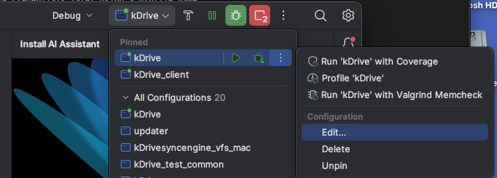
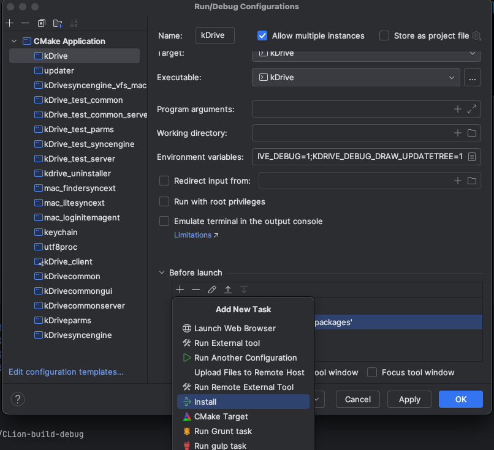
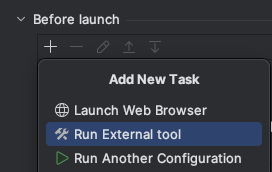
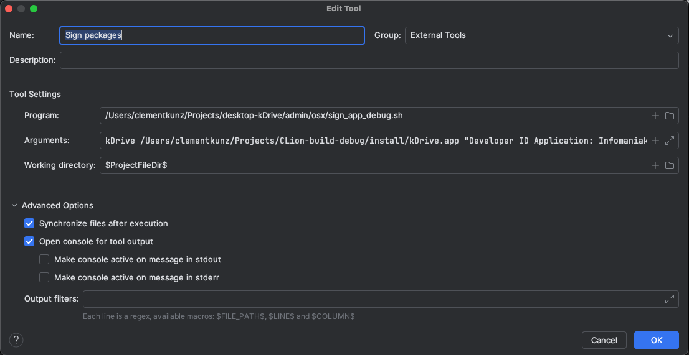

# kDrive Desktop Configuration - MacOS

- [kDrive files](#kdrive-files)
- [Installation Requirements](#installation-requirements)
	- [SIP](#sip)
	- [Xcode](#xcode)
	- [Qt 6.2.3](#qt-623)
	- [Sentry](#sentry)
	- [log4cplus](#log4cplus)
	- [cppunit](#cppunit)
	- [OpenSSL](#openssl)
	- [Poco](#poco)
	- [xxHash](#xxhash)
	- [libzip](#libzip)
	- [Sparkle](#sparkle)
	- [Packages](#packages)
	- [Notarytool](#notarytool)
- [Build in Debug](#build-in-debug)
	- [Using CLion](#using-clion)
        - [CMake Parameters](#cmake-parameters)
		- [Run CMake install](#run-cmake-install)
		- [Sign package](#sign-package)
	- [Using Qt Creator](#using-qt-creator)
		- [Qt Configuration](#qt-configuration)
- [Build in Release](#build-in-release)
	- [Requirements](#requirements)
	- [Build](#build)
- [Disabling the SIP in VMWare Fusion](#disabling-sip-in-vmware-fusion)

# kDrive files

The directory `~/Projects` will be used for the installation in this documentation.  
If you wish to have the sources elsewhere, feel free to use the path you want.

```bash
cd ~/Projects
git clone https://github.com/Infomaniak/desktop-kDrive.git
cd desktop-kDrive && git submodule update --init --recursive
```

# Installation Requirements

## SIP

With some VM software, it isn't possible to boot in recovery mode after the initial installation (ex: VMWare Fusion, Parallels Desktop).  
Therefore, you need to [disable the SIP](https://developer.apple.com/documentation/security/disabling_and_enabling_system_integrity_protection) as soon as possible in the initial setup of macOS.  
If you forgot to disable it and your VM is using VMWave Fusion, see [this section](#disabling-sip-in-vmware-fusion) to disable it.

## Xcode

Xcode is required to build this project on MacOs, if you do not have it installed, you can download it from the App Store.  
Once installed, run the following command :

```bash
sudo xcode-select -s /Applications/Xcode.app/Contents/Developer
```

## QT 6.2.3

From the [Qt Installer](https://www.qt.io/download-qt-installer-oss?hsCtaTracking=99d9dd4f-5681-48d2-b096-470725510d34%7C074ddad0-fdef-4e53-8aa8-5e8a876d6ab4), tick the **Archive** box to see earlier Qt versions.  
In QT 6.2.3, select :
- macOS
- Sources
- QT 5 Compatibility Module

In Qt 6.2.3 Additional Libraries, select :
- Qt WebEngine
- Qt Positioning
- Qt WebChannel
- Qt WebView

Add CMake in PATH (.zshrc):

```bash
export PATH=$PATH:~/Qt/Tools/CMake/CMake.app/Contents/bin
export ALTOOL_USERNAME=<email address>
export QTDIR=~/Qt/6.2.3/macos
```

## Sentry

Download [Sentry Sources](https://github.com/getsentry/sentry-native/releases) (you can download the released zip and extract it to `~/Projects`)  

```bash
cd ~/Projects/sentry-native
cmake -B build -DSENTRY_BACKEND=crashpad -DSENTRY_INTEGRATION_QT=YES -DCMAKE_BUILD_TYPE=RelWithDebInfo -DCMAKE_OSX_ARCHITECTURES="x86_64;arm64" -DCMAKE_OSX_DEPLOYMENT_TARGET="10.15" -DCMAKE_PREFIX_PATH=$QTDIR/lib/cmake
cmake --build build --parallel
sudo cmake --install build
```

## log4cplus

Download and build log4cplus :

```bash
cd ~/Projects
git clone --recurse-submodules https://github.com/log4cplus/log4cplus.git
cd log4cplus
git checkout 2.1.x
mkdir build
cd build
cmake .. -DUNICODE=1 -DCMAKE_OSX_ARCHITECTURES="x86_64;arm64" -DCMAKE_OSX_DEPLOYMENT_TARGET="10.15"
sudo cmake --build . --target install
```

If an error occurs with the the include of `catch.hpp`, you need to change branch inside the `catch` directory:

```bash
cd ../catch
git checkout v2.x
```

## CPPUnit

Download and build CPPUnit :

You will probably need to install `automake` and `libtool`:
```
brew install automake
brew install libtool
```

CPPUnit must be build in single architecture. Replace with `x86_64` or `arm64` in the following command:
```bash
cd ~/Projects
git clone git://anongit.freedesktop.org/git/libreoffice/cppunit
cd cppunit
./autogen.sh
./configure CXXFLAGS="-arch <your_arch> -mmacosx-version-min=10.15"
make
sudo make install
```

If the server does not reply to the `git clone` command, you can download the source from https://dev-www.libreoffice.org/src/.

## OpenSSL

Download and build OpenSSL :

Configure x86_64 :

```bash
cd ~/Projects
git clone https://github.com/openssl/openssl.git
cd openssl
git checkout tags/openssl-3.2.1
cd ..
mv openssl openssl.x86_64
cp -Rf openssl.x86_64 openssl.arm64
mkdir openssl.multi
cd openssl.x86_64
./Configure darwin64-x86_64-cc shared -mmacosx-version-min=10.15
make
```

If you have an AMD architecture, run `sudo make install` then continue

Configure ARM :

```bash
cd ~/Projects/openssl.arm64
./Configure darwin64-arm64-cc shared enable-rc5 zlib no-asm -mmacosx-version-min=10.15 
make
```

If you have an ARM architecture, run `sudo make install` then continue

```bash
cd ~/Projects
lipo -arch arm64 openssl.arm64/libcrypto.3.dylib -arch x86_64 openssl.x86_64/libcrypto.3.dylib -output openssl.multi/libcrypto.3.dylib -create
lipo -arch arm64 openssl.arm64/libssl.3.dylib -arch x86_64 openssl.x86_64/libssl.3.dylib -output openssl.multi/libssl.3.dylib -create
lipo -arch arm64 openssl.arm64/libcrypto.a -arch x86_64 openssl.x86_64/libcrypto.a -output openssl.multi/libcrypto.a -create
lipo -arch arm64 openssl.arm64/libssl.a -arch x86_64 openssl.x86_64/libssl.a -output openssl.multi/libssl.a -create
sudo cp openssl.multi/* /usr/local/lib/
```

## Poco

> :warning: **`Poco` requires [OpenSSL](#openssl) to be installed.**

Download and build Poco :

```bash
cd ~/Projects
git clone https://github.com/pocoproject/poco.git
cd poco
git checkout tags/poco-1.13.3-release
mkdir build
cd build
cmake .. -DCMAKE_OSX_ARCHITECTURES="x86_64;arm64" -DCMAKE_OSX_DEPLOYMENT_TARGET="10.15" -DOPENSSL_ROOT_DIR=/usr/local/ -DOPENSSL_INCLUDE_DIR=/usr/local/include/ -DOPENSSL_CRYPTO_LIBRARY=/usr/local/lib/libcrypto.dylib -DOPENSSL_SSL_LIBRARY=/usr/local/lib/libssl.dylib -DENABLE_DATA_ODBC=OFF 
sudo cmake --build . --target install
```

## xxHash

Download and build xxHash :

```bash
cd ~/Projects
git clone https://github.com/Cyan4973/xxHash.git
cd xxhash
git checkout tags/v0.8.2
cd cmake_unofficial
mkdir build
cd build
cmake .. -DCMAKE_OSX_ARCHITECTURES="x86_64;arm64" -DCMAKE_OSX_DEPLOYMENT_TARGET="10.15"
sudo cmake --build . --target install
```

## libzip  

> :warning: because the cmake builds in multi-architecture, `libzip` and its dependencies (in this case `zstd` must be installed in multi-architecture as well)

Install `zstd` for multi-architecture :
```bash
cd ~/Projects
curl -o zstd-1.5.6.tar.gz -L https://github.com/facebook/zstd/archive/v1.5.6.tar.gz
tar xzf zstd-1.5.6.tar.gz
mkdir -p zstd-1.5.6/build/cmake/build && cd zstd-1.5.6/build/cmake/build
cmake -DCMAKE_BUILD_TYPE=Release -DCMAKE_OSX_ARCHITECTURES="arm64;x86_64" -DCMAKE_OSX_DEPLOYMENT_TARGET="10.15" ..
cmake --build . --config Release
sudo cmake --build . --config Release --target install
```

Clone and install libzip
```bash
cd ~/Projects
git clone https://github.com/nih-at/libzip.git
cd libzip
git checkout tags/v1.10.1
mkdir build && cd build
cmake -DCMAKE_OSX_ARCHITECTURES="arm64;x86_64" -DCMAKE_OSX_DEPLOYMENT_TARGET="10.15" -Dzstd_SHARED_LIBRARY="/usr/local/lib/libzstd.1.5.6.dylib" -Dzstd_INCLUDE_DIR="/usr/local/include" ..
make
sudo make install
```

## Sparkle

Download [Sparkle](https://github.com/sparkle-project/Sparkle/releases/tag/2.6.4) version 2.6.4 and copy the Sparkle directory in `~` and name it "Sparkle"  
Copy and paste **Sparkle.Frameworks** in `~/Library/Frameworks` (create the directory is needed)

## Packages

Install [Packages](http://s.sudre.free.fr/Software/Packages/about.html)

## Notarytool

Access [Apple account manager](https://appleid.apple.com/account/manage) and click on `Generate password`
Enter `notarytool` as application name  
Copy the previously generated password to use in the command below :

```bash
xcrun notarytool store-credentials "notarytool" --apple-id <email address> --team-id [team-id] --password <password>
```

# Build in Debug

## Linking dependencies

In order for CMake to be able to find all dependencies, you might need to define `DYLD_LIBRARY_PATH=/usr/local/lib` in your environment variables.
Either add `export DYLD_LIBRARY_PATH=$DYLD_LIBRARY_PATH:/usr/local/lib` in your personal `.zshrc` file or add the environment variable in your IDE.

## Using CLion

### CMake Parameters

CMake options:

```
-DCMAKE_BUILD_TYPE:STRING=Debug
-DAPPLICATION_CLIENT_EXECUTABLE=kdrive_client
-DKDRIVE_THEME_DIR=/Users/<user_name>/Projects/desktop-kDrive/infomaniak
-DCMAKE_INSTALL_PREFIX=/Users/clementkunz/Projects/CLion-build-debug/install
-DBUILD_UNIT_TESTS:BOOL=ON
-DCMAKE_PREFIX_PATH:STRING=/Users/<user_name>/Qt/6.2.3/macos
-DSOCKETAPI_TEAM_IDENTIFIER_PREFIX:STRING=864VDCS2QY
```

### Run CMake install

Edit the `kDrive` profile:



Add `CMake install` in the `Before launch` steps:



### Sign package

Add a `Run external tool` in the `Before launch` steps:



Create the external tool to run `sign_app_debug.sh`:



## Using Qt Creator

### Qt Configuration

Open the kDrive project in Qt Creator   
In the project build settings, paste the following lines in the Initial Configuration Batch Edit (replace `<user>`)

```
-GUnix Makefiles
-DCMAKE_BUILD_TYPE:STRING=Debug
-DCMAKE_PROJECT_INCLUDE_BEFORE:PATH=%{IDE:ResourcePath}/package-manager/auto-setup.cmake
-DQT_QMAKE_EXECUTABLE:STRING=%{Qt:qmakeExecutable}
-DCMAKE_PREFIX_PATH:STRING=%{Qt:QT_INSTALL_PREFIX}
-DCMAKE_C_COMPILER:STRING=%{Compiler:Executable:C}
-DCMAKE_CXX_COMPILER:STRING=%{Compiler:Executable:Cxx}
-DAPPLICATION_CLIENT_EXECUTABLE=kdrive
-DSOCKETAPI_TEAM_IDENTIFIER_PREFIX=<team id>
-DKDRIVE_THEME_DIR=/Users/<user>/Projects/desktop-kDrive/infomaniak
-DCMAKE_INSTALL_PREFIX=/Users/<user>/Projects/build-desktop-kDrive-Qt_6_2_3_for_macOS-Debug/install
-DBUILD_TESTING=OFF
%{CMAKE_OSX_ARCHITECTURES:DefaultFlag}
```

Build - Build Steps - Build :  
`cmake --build . --target all install`

Build - Build Steps - Custom Process Step 1 :  
`Command    : %{Qt:QT_INSTALL_BINS}/macdeployqt`  
`Arguments    : %{buildDir}/bin/kDrive.app -no-strip -executable=%{buildDir}/bin/kDrive.app/Contents/MacOS/kDrive_client`
`Working directory  : %{buildDir}`

Build - Build Steps - Custom Process Step 2 :  
`Command	: /Users/<user name>/Projects/kdrive/admin/osx/sign_app_debug.sh`  
`Arguments	: %{ActiveProject:RunConfig:Executable:FileName} %{buildDir}/install/kDrive.app "Developer ID Application: Infomaniak Network SA (864VDCS2QY)" "864VDCS2QY" "com.infomaniak.drive.desktopclient" 2>&1 1>/dev/null`
`Working directory  : %{buildDir}`

Run CMake again and start building the project.

# Build in Release

## Requirements

To generate the install kit, [Python 3](https://www.python.org/downloads/) must be installed, as well as the `BeautifulSoup` and `lxml` packages  
You can install them with the following commands :
```bash
pip3 install beautifulsoup4
pip3 install bs4 lxml
```

## Build

In a terminal :

```bash
cd ~/Projects/desktop-kDrive
```
For a simple unsigned build :

```bash
infomaniak-build-tools/macos/build-drive.sh 
```

# Disabling SIP in VMWare Fusion

To Debug the application, the SIP needs to be disabled, this is because the extension is not signed and notarized in Debug mode.  
If you are debugging on a Mac device, you can follow the [official Apple documentation](https://developer.apple.com/documentation/security/disabling_and_enabling_system_integrity_protection) to disable it.  
If you want to debug on a MacOS VM, disabling the SIP depends on the tool you are using, here is one way to disable it on VMWare Fusion :
- From a terminal in your VM, run `sudo nvram Asr-active-config=%7%00%00%00` to create a misspelled variable
- Shut down the VM, and from its settings, go to `Startup Disk`, hold down the `Option` key, and select `Restart to Firmware`
- Select `EFI Internal Shell` as boot option
- You can clear the window by entering `mode 128 40`
- Set the current filesystem volume to EFI : `fs0:`
- Type `vol` to verify the selected filesystem is labeled `EFI`. If not, you can use `fs1:`, `fs2:` and so forth until you select the correct one
- Enter the command `dmpstore Asr-active-config -s csr.bin` to save the active-config to csr.bin
- Use `hexedit csr.bin` to edit the `csr.bin` file.
- You will need to replace the hex `41` by `63` in the first line.
- Save changes and exit, then type `cmpstore -l csr.bin` to create the csr-active-config variable in NVRAM
- Type `dmpstore -d Asr-active-config` to remove the old invalid variable
- Type `exit` to leave the Shell, and select `Mac OS X` from the Boot Manager
- Your SIP should be disabled, you can check by opening a Terminal on your VM and typing `csrutil status`
[source](https://apple.stackexchange.com/a/415100)
