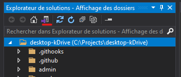
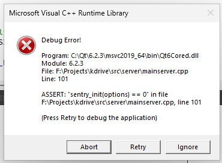

# kDrive Desktop Configuration - Windows

- [kDrive files](#kdrive-files)
- [Installation Requirements](#installation-requirements)
    - [Qt 6.2.3](#qt-623)
    - [Sentry](#sentry)
    - [Poco](#poco)
    - [CPPUnit](#cppunit)
    - [Zlib](#zlib)
    - [libzip](#libzip)
    - [C++ Redistributable](#redistributable)
    - [NSIS](#nsis)
    - [7za](#7za)
    - [Conan](#conan)
- [Certificate Configuration](#certificate-configuration)
- [Build in Debug](#build-in-debug)
    - [Using CLion](#using-clion)
        - [CMake Parameters](#cmake-parameters)
    - [Using Qt Creator](#using-qt-creator)
        - [Additionnal Requirements](#additionnal-requirements)
        - [CMake Parameters](#cmake-parameters)
    - [VS2019](#using-Visual-Studio-2019)
        - [Windows extension](#windows-Extension)
        - [Project setup](#project-Setup)
        - [CMake configuration](#cmake-Configuration)
        - [DLL Copy](#dll-Copy)
        - [Debugging](#debugging)
    - [Testing the extension](#testing-the-extension)
- [Build in Release](#build-in-release)
    - [Build and Packaging](#build-and-packaging)
- [Possible build errors](#possible-build-errors)

# kDrive files

The folder `F:\Projects` will be used for the installation of sources and dependencies.  
Feel free to use any directory that suits you.

```powershell
mkdir F:\Projects 
cd F:\Projects
git clone https://github.com/Infomaniak/desktop-kDrive.git
cd desktop-kDrive && git submodule update --init --recursive
```

# Installation Requirements

Once `Visual Studio 2019` is installed, **all** commands should to be run using the `x64 Native Tools Command Prompt` with administrator permissions.  

## Visual Studio 2019

When installing `Visual Studio 2019`, select the following components:

- Desktop development with C++
- Universal Windows Platform Development
- .NET SDK
- .NET Core 3.1 Runtime
- .NET 5.0 Runtime
- .NET framework 4.7 SDK
- Windows 11 SDK (10.0.22000.0)
- Windows 10 SDK (10.0.17763.0)
- Windows 10 SDK (10.0.20348.0)
## Qt 6.2.3

From the [Qt Installer](https://www.qt.io/download-qt-installer-oss?hsCtaTracking=99d9dd4f-5681-48d2-b096-470725510d34%7C074ddad0-fdef-4e53-8aa8-5e8a876d6ab4), 
tick the **Archive** box and then press the `Refresh` button to see earlier `Qt` versions.  
In `Qt 6.2.3`, select:
- MSVC 2019 64-bit
- Sources
- Qt 5 Compatibility Module

In `Qt 6.2.3 Additional Libraries`, select :
- Qt WebEngine
- Qt Positioning
- Qt WebChannel
- Qt WebView
- Qt Debug Information Files (only if you want to use a debugger)

In `Developer and Designer Tools` (should be selected by default):
- CMake
- Ninja

Add an environment variable named `QTDIR`, set with the path of your Qt msvc folder (which defaults to `C:\Qt\6.2.3\msvc2019_64`).
Add to the following paths to your `PATH` or adapt them to the actual location of your Qt folder if needed:
- `C:\Qt\6.2.3\msvc2019_64\bin`
- `C:\Qt\Tools\CMake_64\bin`

## Sentry

Download the [Sentry sources (`sentry-native.zip`)](https://github.com/getsentry/sentry-native/releases) and extract them to `F:\Projects`.
After successful extraction, run:

```cmd
cd F:\Projects\sentry-native
cmake -B build -DSENTRY_INTEGRATION_QT=YES -DCMAKE_PREFIX_PATH=%QTDIR%
cmake --build build --config RelWithDebInfo
cmake --install build --config RelWithDebInfo
```

## Poco

> :warning: **`Poco` requires OpenSSL to be installed.**

Clone and build `Poco`:

```powershell
cd F:\Projects
git clone https://github.com/pocoproject/poco.git
cd poco
git checkout tags/poco-1.13.3-release
mkdir build
cd build
cmake -G "Visual Studio 16 2019" .. -DOPENSSL_ROOT_DIR="C:\Program Files\OpenSSL" -DOPENSSL_INCLUDE_DIR="C:\Program Files\OpenSSL\include" -DOPENSSL_CRYPTO_LIBRARY=libcrypto.lib -DOPENSSL_SSL_LIBRARY=libssl.lib
```

Open the `poco.sln` solution in Visual Studio 2019 and add `C:\Program Files\OpenSSL-Win64\lib` to the `Additional Library Directories` for the following projects:
- Crypto
- JWT
- NetSSL

While still in the `build` directory, issue the following commands:

```powershell
cmake --build . --target install --config Debug
cmake --build . --target install --config Release
```

## CPPUnit

Clone `CPPUnit`:

```powershell
cd F:\Projects
git clone git://anongit.freedesktop.org/git/libreoffice/cppunit
```

If the server does not reply to the `git clone` command, you can download the source from https://www.freedesktop.org/wiki/Software/cppunit/.

Then open `src/CppUnitLibrariesXXXX.sln` workspace in Visual Studio to configure as follows:
- Select all projects then right click to access `Properties`.
- Select `All configurations` and `All plateforms`,  then add `_ALLOW_ITERATOR_DEBUG_LEVEL_MISMATCH` in `C/C++ > Preprocessor > Preprocessor Definitions`.
- In the `Build` menu, select `Batch Build...`.
- Select all projects in `x64` version and click on `build`.

Copy `lib` and `include` folders from F:\Projects\cppunit\` to `C:\Program Files (x86)\cppunit`.

## Zlib

> :warning: `zlib` is currently managed by [Conan](#conan) for OpenSSL, but it is also needed for libzip. Since libzip is not managed by Conan, you must install zlib manually using the instructions below.

Download [Zlib](https://zlib.net/fossils/zlib-1.2.11.tar.gz) then run the following:
```cmd
F:
tar -xvzf %USERPROFILE%\Downloads\zlib-1.2.11.tar.gz -C F:\Projects
cd F:\Projects\zlib-1.2.11
nmake /f win32/Makefile.msc
mkdir include
copy zconf.h include\
copy zlib.h include\
mkdir lib
copy zdll.lib lib\
copy zlib.lib lib\
copy zlib.pdb lib\
mkdir bin
copy zlib1.dll bin\
copy zlib1.pdb bin\
mkdir "C:\Program Files (x86)\zlib-1.2.11\include"
copy include\* "C:\Program Files (x86)\zlib-1.2.11\include\"
mkdir "C:\Program Files (x86)\zlib-1.2.11\lib"
copy lib\* "C:\Program Files (x86)\zlib-1.2.11\lib\"
```

## libzip

> :warning: **`libzip` requires [zlib](#zlib) to be installed.**

Clone and install libzip

```powershell
cd F:\Projects
git clone https://github.com/nih-at/libzip.git
cd libzip
git checkout tags/v1.10.1
mkdir build && cd build
cmake .. -DZLIB_LIBRARY="C:\Program Files (x86)\zlib-1.2.11\lib\zlib.lib" -DZLIB_INCLUDE_DIR:PATH="C:/Program Files (x86)/zlib-1.2.11/include"
cmake --build . --target install --config Debug
cmake --build . --target install --config Release
```

## Redistributable

Create the `F:\Projects\vcredist` folder and copy-paste the [C++ Redistributable](https://docs.microsoft.com/en-us/cpp/windows/latest-supported-vc-redist?view=msvc-170) `x64` and `arm64` 
inside it.

## NSIS

Download and install [NSIS v3.03](https://sourceforge.net/projects/nsis/files/NSIS%203/3.03/nsis-3.03-setup.exe/download).
Add the `NSIS` path to the `PATH` environment variable.
You will need the following `NSIS` plugins:
- `LogicLib`
- `nsProcess`
- `UAC`
- `x64`

## 7za

Download [7za](https://sourceforge.net/projects/sevenzip/files/7-Zip/23.01/7z2301-extra.7z/download) and extract it in `C:\Program Files\7-Zip`. This 
requires the prior installation of `7-Zip`.

## Icoutils

Download [Icoutils](https://sourceforge.net/projects/unix-utils/files/icoutils/icoutils-0.32.3-x86_64.zip/download) and extract it.
Add the path to the `Icoutils` folder to your `PATH` environment variable, e.g. `C:\Program Files\icoutils-0.32.3-x86_64\bin`. 

# Certificate Configuration

To be able to sign executables, you need to have one of two the Infomaniak certificates installed.
We use the virtual certificate for `DEBUG` builds and the physical certificate (USB key) for release builds.
 
Once the certificates are installed on your machine, open `F:\Projects\desktop-kDrive\extensions\windows\cfapi\kDriveExt.sln` and follow the next steps 
to create an environment variable for each certificate:
- Select `FileExplorerExtensionPackage\Package.appxmanifest`.
- Go to the `Packaging` tab.
- Click on `Choose Certificate...` then `Select from store`.
- Copy the `AUMID` (located at the end of the `Family Name` field, after the underscore).
- Create an environment variable named `KDC_VIRTUAL_AUMID` with the copied `AUMID` as value.
- Repeat the same steps using the USB key certificate, in an environment variable named `KDC_PHYSICAL_AUMID`.
---

## Conan
The recommended way to install Conan is via **pip** within a Python virtual environment (Python 3.6 or newer). This approach ensures isolation and compatibility with your project’s dependencies.

> **Tip:** Other installation methods (system packages, pipx, installer scripts, etc.) are also supported. See [Conan Downloads](https://conan.io/downloads) for the full list of options.
### Prerequisites
- **Python 3.6+**
- **pip**:

### 1. Create and Activate a Virtual Environment
1. Create a virtual environment in `./.venv`:
   ```powershell
   python -m venv .venv
   ```
2. Activate the virtual environment:
   ```powershell
   & ./.venv\Scripts\Activate.ps1
   ```
2.1 Update the `pip` version:
   ```powershell
   python -m pip install --upgrade pip
   ```

### 2. Install Conan

With the virtual environment active, install Conan:
```powershell
pip install conan
```

Verify the installation:
```powershell
conan --version
```
You should see an output similar to:
```
Conan version 2.x.x
```

---

### 3. Configure a Conan Profile
1. Auto-generate the default profile:
   ```cmd
   conan profile detect
   ```
   This creates `%USERPROFILE%/.conan2/profiles/default`.

2. Open `%USERPROFILE%/.conan2/profiles/default` and customize the settings under the `[settings]` section. For example, to target Windows with C++20 with a debug build type:
   
   ```ini
    [settings]
    arch=x86_64
    build_type=Debug
    compiler=msvc
    compiler.cppstd=20
    compiler.runtime=dynamic
    compiler.version=192
    os=Windows
   ```

---

### 4. Configure CMake Toolchain Injection
The project requires additional CMake variables for a correct build. To inject these, create a file named `debug_vars.cmake` in your profiles directory (`~/.conan2/profiles`), and then reference it in the profile under `[conf]`:

1. Create or open `%USERPROFILE%/.conan2/profiles/debug_vars.cmake` and add the cache entries adapted to your installation, for example:
   ```cmake
   set(APPLICATION_CLIENT_EXECUTABLE "kdrive_client")
   set(KDRIVE_THEME_DIR "F:/Projects/desktop-kDrive/infomaniak")
   set(BUILD_UNIT_TESTS "ON")      # Set to "OFF" to skip tests
   set(SOCKETAPI_TEAM_IDENTIFIER_PREFIX "864VDCS2QY")
   set(CMAKE_PREFIX_PATH "C:/Qt/6.2.3/msvc2019_64")
   set(CMAKE_INSTALL_PREFIX "F:/Projects/cmake-build-release_CLion")
   set(ZLIB_INCLUDE_DIR "C:/Program Files (x86)/zlib-1.2.11/include")
   set(ZLIB_LIBRARY_RELEASE "C:/Program Files (x86)/zlib-1.2.11/lib/zlib.lib")
   set(VFS_STATIC_LIBRARY "F:/Projects/desktop-kDrive/extensions/windows/cfapi/x64/Debug/Vfs.lib")
   set(VFS_DIRECTORY "F:/Projects/desktop-kDrive/extensions/windows/cfapi/x64/Debug")
   ```

2. In your profile (`%USERPROFILE%/.conan2/profiles/default`), add under a new `[conf]` section:
   ```ini
   [conf]
   tools.cmake.cmaketoolchain:user_toolchain+={{profile_dir}}/debug_vars.cmake
   ```

---

### 5. Configure the Release Profile

To **build a release version** using the script `./infomaniak-build-tools/windows/build-release.ps1`, you must create a profile named `infomaniak_release`.
You can create a copy of the previously defined profile, but this profile **must not** contain a `tools.cmake.cmaketoolchain:user_toolchain` entry and **must** have the `build_type` set to `Release` or `RelWithDebInfo`.

---

### 6. Install Project Dependencies

**From the repository root**, run the provided build script, specifying the desired configuration (`Debug` or `Release`) and the folder where the app will be builded.
```powershell
powershell ./infomaniak-build-tools/conan/build_dependencies.ps1 [Debug|Release] [-OutputDir <output_dir>]
```

> **Note:** Currently only **xxHash**, **log4cplus**, **OpenSSL** and **zlib** are managed via this Conan-based workflow. Additional dependencies will be added in future updates.

---
# Build in Debug

To build in `Debug` mode, you will need to build and deploy the Windows extension first.

## Linking dependencies

In order for CMake to be able to find all dependencies, add all libraries installation folder in the `PATH` environment variable:
```
C:\Program Files (x86)\Poco\bin
C:\Program Files (x86)\libzip\bin
C:\Program Files (x86)\Sentry-Native\bin
C:\Program Files (x86)\cppunit\bin
```

Since some dependencies are now managed by Conan, you may also need to run the `conanrun.bat` script to append the paths of the Conan-installed dependencies to the `PATH` environment variable.

## Using CLion

### CMake Parameters

After executing the `build_dependencies.ps1` script, Conan generates a `CMakeUserPresets.json` file in the root of the project and in the build directory. See [Conan documentation](https://docs.conan.io/2/examples/tools/cmake/cmake_toolchain/build_project_cmake_presets.html) for more information.
This file contains the path to the `conan_toolchain.cmake` file generated, which contains the variables required to build the project if you followed the [step 4](#4-configure-cmake-toolchain-injection) of the Conan part.
In CLion, in the CMake profile menu, you should see something like `conan-default` or `conan-$BuildType` with `$BuildType` equal to a C++ build type like debug or release.
Enable this profile to let CLion load the CMake project.

## Using Qt Creator

You can disable QML debugger from the settings to avoid some error pop-ups.

### Additionnal Requirements

To be able to properly debug, you will need to install the `Qt Debug Information Files` from the [`Qt 6.2.3` Section](#qt-623).
If you cannot see it, you need to tick the **Archive** box and filter again.

### CMake Parameters

Open the file `F:\Projects\desktop-kDrive\CMakeList.txt` in Qt Creator.  
Then copy the following list of `CMake` variables in "Initial CMake Parameters" using batch editing:

```
-GNinja
-DCMAKE_BUILD_TYPE:String=Debug
-DQT_QMAKE_EXECUTABLE:STRING=%{Qt:qmakeExecutable}
-DCMAKE_PREFIX_PATH:STRING=%{Qt:QT_INSTALL_PREFIX}
-DCMAKE_C_COMPILER:STRING=%{Compiler:Executable:C}
-DCMAKE_CXX_COMPILER:STRING=%{Compiler:Executable:Cxx}
-DAPPLICATION_UPDATE_URL:STRING=https://www.infomaniak.com/drive/update/desktopclient
-DAPPLICATION_VIRTUALFILE_SUFFIX:STRING=kdrive
-DBIN_INSTALL_DIR:PATH=F:/projects/desktop-kDrive
-DVFS_DIRECTORY:PATH=F:/Projects/desktop-kDrive/extensions/windows/cfapi/x64/Debug
-DCMAKE_EXE_LINKER_FLAGS_DEBUG:STRING=/debug /INCREMENTAL
-DCMAKE_EXE_LINKER_FLAGS_RELWITHDEBINFO:STRING=/debug /INCREMENTAL
-DCMAKE_INSTALL_PREFIX:PATH=%{ActiveProject:RunConfig:Executable:Path}/..
-DKDRIVE_THEME_DIR:STRING=F:/projects/desktop-kDrive/infomaniak
-DPLUGINDIR:STRING=C:/Program Files (x86)/kDrive/lib/kDrive/plugins
-DZLIB_INCLUDE_DIR:PATH=C:/Program Files (x86)/zlib-1.2.11/include
-DZLIB_LIBRARY_RELEASE:FILEPATH=C:/Program Files (x86)/zlib-1.2.11/lib/zlib.lib
-DBUILD_TESTING=OFF
-DCMAKE_TOOLCHAIN_FILE=F:\Projects\desktop-kDrive\build-windows\build\conan_toolchain.cmake
```

Then click "Re-configure with Initial Parameters".

## Using Visual Studio 2019
### Windows Extension

To build in Debug mode, you'll need to build and deploy the Windows extension first.
Check first your [certificates configuration](# Certificate Configuration) before following the next steps:

1. Open the `kDriveExt` solution located at `F:\Projects\desktop-kDrive\extensions\windows\cfapi`.
2. Navigate to the post-build events of the `Vfs` project: right click on the `Vfs` project and follow `Properties > Configuration properties > Build Events > Post-Build Event`.
3. Select `x64` in the `Platform` drop-down menu.
4. Modify `F:\Projects\` to match your actual path. The last two paths are outputs of the global projects; keep them for later steps.
5. Save and close the properties window.

Select `Debug x64` and deploy. 

To build in Release mode, repeat the same steps for `Release x64`.

Close the `kDriveExt` solution.

### Project Setup

Open `Visual Studio 2019` and select `Open local folder`. Then choose `F:\Projects\desktop-kDrive`.


### CMake Configuration

1. On the configuration selector, click on "Manage configurations".
2. Create a new configuration `x64 Debug`.
3. Configure it as follows:
   - Configuration type: Debug
   - Toolset: msvc_x64_x64
   - Build root: The folder set in the post-build events of the `kDriveExt` solution.
   - CMake command args: 
    ```
    -DAPPLICATION_CLIENT_EXECUTABLE=kdrive_client 
    -DKDRIVE_THEME_DIR=F:/Projects/desktop-kDrive/infomaniak 
    -DBUILD_UNIT_TESTS:BOOL=ON 
    -DCMAKE_PREFIX_PATH:STRING=C:/Qt/6.2.3/msvc2019_64 
    -DSOCKETAPI_TEAM_IDENTIFIER_PREFIX:STRING=864VDCS2QY 
    -DZLIB_INCLUDE_DIR:PATH="C:/Program Files (x86)/zlib-1.2.11/include" 
    -DZLIB_LIBRARY_RELEASE:FILEPATH="C:/Program Files (x86)/zlib-1.2.11/lib/zlib.lib" 
    -DVFS_STATIC_LIBRARY:FILEPATH=F:/Projects/desktop-kDrive/extensions/windows/cfapi/x64/Debug/Vfs.lib 
    -DVFS_DIRECTORY:PATH=F:/Projects/desktop-kDrive/extensions/windows/cfapi/x64/Debug 
    -DPocoCrypto_DIR:PATH="C:/Program Files (x86)/Poco/cmake" 
    -DPocoFoundation_DIR:PATH="C:/Program Files (x86)/Poco/cmake" 
    -DPocoJSON_DIR:PATH="C:/Program Files (x86)/Poco/cmake" 
    -DPocoNetSSL_DIR:PATH="C:/Program Files (x86)/Poco/cmake" 
    -DPocoNet_DIR:PATH="C:/Program Files (x86)/Poco/cmake" 
    -DPocoUtil_DIR:PATH="C:/Program Files (x86)/Poco/cmake" 
    -DPocoXML_DIR:PATH="C:/Program Files (x86)/Poco/cmake" 
    -DPoco_DIR:PATH="C:/Program Files (x86)/Poco/cmake"
    ```
   You may need to adjust paths based on your installation.
   
   - Check that `Advanced settings > install path` is the the build root path.

Save (CTRL + S). `CMake` will automatically run in the output window. 
Make sure no errors occur.

### Install

In the `Solution Explorer`, go to the available view:



Select `CMake` targets.
Right-click on the `kDrive` executable and then on `Install`.
Once done, right-click on the `kDrive_client` executable and then on `Install`.


### DLL Copy

During the next step, you may encounter missing DLL errors. If so, copy the required DLLs into the `bin` folder of your output directory. The DLLs are located in:
- `C:\Program Files (x86)\Poco\bin`
- `C:\Program Files (x86)\NSIS\Bin`
- `C:\Program Files (x86)\zlib-1.2.11`
- `C:\Program Files\OpenSSL\bin`

### Debugging

In the `Solution Explorer`, go to the available view:
Select CMake targets.

Right-click on the `kDrive executable`: `Debug > kDrive.exe`.

Once `kDrive.exe` is running, right-click on the client executable: `Debug > kDrive_client.exe`.

Once `kDrive.exe` is running, right-click on the `kDrive_client` executable: `Debug > kDrive_client.exe`.


## Testing the extension

To test the extension in Debug mode, you will first need to install a [release version](https://www.infomaniak.com/en/apps/download-kdrive) of `kDrive`.  
Once installed and running, stop the `File Explorer` with the command:

```powershell
taskkill /f /im explorer.exe
```

Then, copy the DLLs :

```powershell
copy "F:\Projects\build-kdrive-Desktop_Qt_6_2_3_MSVC2019_64bit-Debug\bin\KDContextMenu.dll" "C:\Program Files (x86)\kDrive\shellext"
copy "F:\Projects\build-kdrive-Desktop_Qt_6_2_3_MSVC2019_64bit-Debug\bin\KDOverlays.dll" "C:\Program Files (x86)\kDrive\shellext"
```

Then restart the `File Explorer`:

```powershell
start explorer.exe
```

# Build in Release

## Build and Packaging

The script `build-drive.ps1` will build, sign, then package the project. You can either start it from the root of the `desktop-kDrive` repository, or provide a path when executing it.    
To get more information, call the script with the option `-h` or `-help`

**Note.** For `CMake` to be able to build the project, you need to initialise the environment for `x64` with `vcvarsall.bat`, or `vcvars64.bat` (see the help output of `build-drive.ps1` for details).

```powershell
cd F:\Projects\desktop-kDrive
powershell infomaniak-build-tools\windows\build-drive.ps1
```

# Possible build errors

When building in Debug mode, the following error may occur when `CMAKE_INSTALL_PREFIX` is incorrect.



The `INSTALL_PREFIX` must not end with `bin`, and if so you will need to adjust its value.
For example, `F:/Projects/build-desktop-kDrive-Desktop_Qt_6_2_3_MSVC2019_64bit-Debug/bin` must be changed to `F:/Projects/build-desktop-kDrive-Desktop_Qt_6_2_3_MSVC2019_64bit-Debug`.
