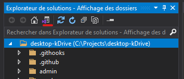

# kDrive Desktop on Windows


## Table of Contents

- [1) Scope](#1-scope)
- [2) Quick Start (recommended path)](#2-quick-start-recommended-path)
- [3) Prerequisites](#3-prerequisites)
  - [Visual Studio 2026](#visual-studio-2026)
  - [Repository checkout](#repository-checkout)
- [4) Certificates](#4-certificates)
  - [Release certificate](#release-certificate)
  - [Debug self-signed certificate](#debug-self-signed-certificate)
- [5) Dependencies](#5-dependencies)
  - [Conan (required)](#conan-required)
  - [CPPUnit](#cppunit)
  - [zlib (manual for libzip)](#zlib-manual-for-libzip)
  - [libzip](#libzip)
  - [NSIS (installer only)](#nsis-installer-only)
  - [7za (installer only)](#7za-installer-only)
  - [Icoutils](#icoutils)
- [6) Debug Build](#6-debug-build)
  - [Add runtime dependencies to PATH](#add-runtime-dependencies-to-path)
  - [Visual Studio 2026 (recommended)](#visual-studio-2026-recommended)
  - [CLion](#clion)
  - [Qt Creator](#qt-creator)
- [7) Test the Windows extension](#7-test-the-windows-extension)
- [8) Release Build and Packaging](#8-release-build-and-packaging)
- [9) Troubleshooting](#9-troubleshooting)
- [Useful links](#useful-links)

---

## 1) Scope

This document explains how to:
- prepare a Windows development machine,
- configure certificates,
- install required dependencies,
- build kDrive in Debug and Release,
- test the Windows shell extension.

---

## 2) Quick Start (recommended path)

If you want the shortest path to a working Debug build:

1. Install [Visual Studio 2026](#visual-studio-2026).
2. Clone the [repository](#repository-checkout).
3. Configure [Conan](#conan-required).
4. Build/deploy the extension (`extensions/windows/cfapi/kDriveExt.sln`).
5. Open the repository folder in Visual Studio and select the `conan-debug` CMake configuration.
6. Run `Install` on `kDrive` and `kDrive_client` targets.

---

## 3) Prerequisites

> Run commands from an **Administrator PowerShell** (or equivalent admin terminal), unless noted otherwise.

### Visual Studio 2026

Download: https://visualstudio.microsoft.com/downloads/

Install:
- **Workloads**
  - Desktop development with C++
  - WinUI application development
- **Individual components**
  - Git for Windows (if not already installed)
  - Windows 11 SDK (10.0.28000.x)

### Repository checkout

Examples in this guide use `C:\Projects`. You can use another directory if you update paths accordingly.

```powershell
mkdir C:\Projects
cd C:\Projects
git clone https://github.com/Infomaniak/desktop-kDrive.git
cd desktop-kDrive
git submodule update --init --recursive
```

---

## 4) Certificates

### Release certificate

For deployment on non-developer machines, use a trusted code-signing certificate installed in the Windows certificate store.

Reference: [Microsoft code-signing requirements](https://learn.microsoft.com/windows-hardware/drivers/dashboard/code-signing-reqs#where-to-get-ev-code-signing-certificates)

### Debug self-signed certificate

For local development only, you can use a self-signed certificate.

#### Step 1 — Create and trust the certificate

```powershell
$cert = New-SelfSignedCertificate `
    -Type Custom `
    -Subject "CN=kDriveDev" `
    -KeyUsage DigitalSignature `
    -FriendlyName "kDriveDev" `
    -CertStoreLocation "Cert:\CurrentUser\My" `
    -TextExtension @("2.5.29.37={text}1.3.6.1.5.5.7.3.3", "2.5.29.19={text}")
Export-Certificate -Cert $cert -FilePath "$env:USERPROFILE\Desktop\kDriveDevCert.cer"
Import-Certificate -FilePath "$env:USERPROFILE\Desktop\kDriveDevCert.cer" -CertStoreLocation "Cert:\CurrentUser\Root"
Import-Certificate -FilePath "$env:USERPROFILE\Desktop\kDriveDevCert.cer" -CertStoreLocation "Cert:\CurrentUser\My"
Get-ChildItem Cert:\CurrentUser\Root | Where-Object { $_.Subject -like "*kDriveDev*" }
Get-ChildItem Cert:\CurrentUser\My   | Where-Object { $_.Subject -like "*kDriveDev*" }
Remove-Item "$env:USERPROFILE\Desktop\kDriveDevCert.cer"
```

#### Step 2 — Bind certificate in extension project and set AUMID env var

1. Open `extensions\windows\cfapi\kDriveExt.sln`.
2. Open `FileExplorerExtensionPackage\Package.appxmanifest`.
3. Go to **Packaging**.
4. Click **Choose Certificate...** > **Select from store** and pick your cert.
5. Copy the AUMID (suffix in the **Family Name** field, after `_`).
6. Create `KDC_DEBUG_AUMID` with that AUMID value.

For release signing, set `KDC_RELEASE_AUMID` similarly. (`build-drive.ps1` will automatically manage the certificate/aumid therefore it is rarely needed to set it manually in a release build.)

---

## 5) Dependencies

### 5.1 Conan (required)
ℹ️ Python 3.11+ is required, [Microsoft Store | Python 3.13](https://apps.microsoft.com/detail/9PNRBTZXMB4Z?hl=en-us&gl=US&ocid=pdpshare)

#### 5.1.1 Create and activate a virtual environment

```powershell
python -m venv .venv
& .\.venv\Scripts\Activate.ps1
python -m pip install --upgrade pip
```

#### 5.1.2 Install Conan

```powershell
pip install conan
conan --version
```

Expected output example:

```text
Conan version 2.x.x
```

#### 5.1.3 Create/update profile

```powershell
conan profile detect
```

Edit `%USERPROFILE%/.conan2/profiles/default`:

```ini
[settings]
arch=x86_64
build_type=Debug
compiler=msvc
compiler.cppstd=20
compiler.runtime=dynamic
compiler.version=195
os=Windows
```

#### 5.1.4 Inject project CMake variables

Create `%USERPROFILE%/.conan2/profiles/debug_vars.cmake`:

```cmake
set(APPLICATION_CLIENT_EXECUTABLE "kdrive_client")
set(KDRIVE_THEME_DIR "C:/Projects/desktop-kDrive/infomaniak")
set(BUILD_UNIT_TESTS "ON")
set(BUILD_GUI "ON")
set(BUILD_GUI_LEGACY "OFF")
set(CMAKE_BUILD_TYPE "Debug")
set(CMAKE_INSTALL_PREFIX "C:/Projects/desktop-kDrive/build-dev-debug")
set(ZLIB_INCLUDE_DIR "C:/Program Files (x86)/zlib-1.2.11/include")
set(ZLIB_LIBRARY_RELEASE "C:/Program Files (x86)/zlib-1.2.11/lib/zlib.lib")
set(VFS_STATIC_LIBRARY "C:/Projects/desktop-kDrive/extensions/windows/cfapi/x64/Debug/Vfs.lib")
set(VFS_DIRECTORY "C:/Projects/desktop-kDrive/extensions/windows/cfapi/x64/Debug")
```

Then add this to `%USERPROFILE%/.conan2/profiles/default`:

```ini
[conf]
tools.cmake.cmaketoolchain:user_toolchain+={{profile_dir}}/debug_vars.cmake
```

#### 5.1.5 Create release profile for `build-drive.ps1`

Create an `infomaniak_release` profile:
- `build_type` must be `Release` or `RelWithDebInfo`.
- Do **not** include `tools.cmake.cmaketoolchain:user_toolchain`.

#### 5.1.6 Install project dependencies

From repository root:

```powershell
powershell .\infomaniak-build-tools\conan\build_dependencies.ps1 [Debug|Release] [-OutputDir <output_dir>] -UpdateEnvironment
```

> ⚠️ Do **not** run this command from a terminal where `vcvarsall.bat`/`vcvars64.bat` is already active if Conan must compile packages in cache.

Currently managed via Conan: **xxHash**, **log4cplus**, **Qt**, **OpenSSL**, **zlib**, **SQLite**, **Sentry**, **Poco**.

### CPPUnit

```powershell
cd C:\Projects
git clone https://anongit.freedesktop.org/git/libreoffice/cppunit
```

Then:
1. Open `src/CppUnitLibrariesXXXX.sln`.
2. Select all projects > **Properties**.
3. Set `All Configurations` and `All Platforms`.
4. Add `_ALLOW_ITERATOR_DEBUG_LEVEL_MISMATCH` to `C/C++ > Preprocessor > Preprocessor Definitions`.
5. Use **Build > Batch Build...**, select all `x64` targets, build all.
6. Copy `lib` and `include` from `C:\Projects\cppunit` to `C:\Program Files (x86)\cppunit`.

### zlib (manual for libzip)

Even if zlib is used in Conan dependency chains, libzip setup here still expects a local manual install.

Download: [zlib-1.2.11.tar.gz](https://zlib.net/fossils/zlib-1.2.11.tar.gz)

```cmd
C:
tar -xvzf %USERPROFILE%\Downloads\zlib-1.2.11.tar.gz -C C:\Projects
cd C:\Projects\zlib-1.2.11
nmake /f win32/Makefile.msc
mkdir include
copy zconf.h include\
copy zlib.h include\
mkdir lib
copy zdll.lib lib\
copy zlib.lib lib\
copy zlib.pdb lib\
mkdir bin
copy zlib1.dll bin\
copy zlib1.pdb bin\
mkdir "C:\Program Files (x86)\zlib-1.2.11\include"
copy include\* "C:\Program Files (x86)\zlib-1.2.11\include\"
mkdir "C:\Program Files (x86)\zlib-1.2.11\lib"
copy lib\* "C:\Program Files (x86)\zlib-1.2.11\lib\"
```

### libzip

Requires [zlib](#zlib-manual-for-libzip).

```powershell
cd C:\Projects
git clone https://github.com/nih-at/libzip.git
cd libzip
git checkout tags/v1.10.1
mkdir build
cd build
cmake .. -DZLIB_LIBRARY="C:\Program Files (x86)\zlib-1.2.11\lib\zlib.lib" -DZLIB_INCLUDE_DIR:PATH="C:/Program Files (x86)/zlib-1.2.11/include"
cmake --build . --target install --config Debug
cmake --build . --target install --config Release
```

### NSIS (installer only)

Install [NSIS v3.03](https://sourceforge.net/projects/nsis/files/NSIS%203/3.03/nsis-3.03-setup.exe/download).

Add NSIS path to `PATH`. Required plugins:
- `LogicLib`
- `nsProcess`
- `UAC`
- `x64`

### 7za (installer only)

Download [7za extra package](https://sourceforge.net/projects/sevenzip/files/7-Zip/23.01/7z2301-extra.7z/download) and extract to `C:\Program Files\7-Zip`.

### Icoutils

Download [Icoutils 0.32.3 x86_64](https://sourceforge.net/projects/unix-utils/files/icoutils/icoutils-0.32.3-x86_64.zip/download), extract it, and add its `bin` path to `PATH`, for example:

`C:\Program Files\icoutils-0.32.3-x86_64\bin`

---

## 6) Debug Build

### Add runtime dependencies to PATH

Ensure these directories are in `PATH`:

```text
C:\Program Files (x86)\libzip\bin
C:\Program Files (x86)\cppunit\bin
```

### Visual Studio 2026 (recommended)

#### Step A — Build and deploy Windows extension

1. Confirm [certificate setup](#4-certificates).
2. Set `KDC_BUILD_PROJECT_DIR` (example: `C:\Projects\desktop-kDrive\build-dev-debug\`).
3. Open `C:\Projects\desktop-kDrive\extensions\windows\cfapi\kDriveExt.sln`.
4. Select `Debug x64` and deploy.

For release extension artifacts, repeat with `Release x64`.

#### Step B — Open and configure kDrive

1. Open Visual Studio 2026.
2. Choose **Open local folder**.
3. Select `C:\Projects\desktop-kDrive`.
4. In configuration selector, choose `conan-debug` (or `conan-release`).
5. Save (`Ctrl+S`) and wait for CMake configure to finish without errors.

#### Step C — Install targets

1. In **Solution Explorer**, switch to **CMake targets view**.
2. Run `Install` on `kDrive`.
3. Run `Install` on `kDrive_client`.

Reference image:



#### Step D — Debug targets

1. In CMake targets view, run `Debug > kDrive.exe`.
2. Once running, run `Debug > kDrive_client.exe`.

If you only need server-side debugging, set:

```text
KDRIVE_DEBUG_RUN_CLIENT=1
```

Then start server debug; client launch is handled automatically.

### CLion

After running `build_dependencies.ps1`, Conan generates `CMakeUserPresets.json` (root + build directory).

In CLion CMake profiles, enable the Conan profile (`conan-default` or `conan-$BuildType`) to load the project.

Conan docs: [Build project with CMake presets](https://docs.conan.io/2/examples/tools/cmake/cmake_toolchain/build_project_cmake_presets.html)

### Qt Creator

You can disable QML debugger to avoid some popups.

Open `C:\Projects\desktop-kDrive\CMakeLists.txt` in Qt Creator and paste the following into **Initial CMake Parameters**:

```text
-GNinja
-DCMAKE_BUILD_TYPE:String=Debug
-DCMAKE_C_COMPILER:STRING=%{Compiler:Executable:C}
-DCMAKE_CXX_COMPILER:STRING=%{Compiler:Executable:Cxx}
-DAPPLICATION_UPDATE_URL:STRING=https://www.infomaniak.com/drive/update/desktopclient
-DAPPLICATION_VIRTUALFILE_SUFFIX:STRING=kdrive
-DBIN_INSTALL_DIR:PATH=C:/projects/desktop-kDrive
-DVFS_DIRECTORY:PATH=C:/Projects/desktop-kDrive/extensions/windows/cfapi/x64/Debug
-DCMAKE_EXE_LINKER_FLAGS_DEBUG:STRING=/debug /INCREMENTAL
-DCMAKE_EXE_LINKER_FLAGS_RELWITHDEBINFO:STRING=/debug /INCREMENTAL
-DCMAKE_INSTALL_PREFIX:PATH=%{ActiveProject:RunConfig:Executable:Path}/..
-DKDRIVE_THEME_DIR:STRING=C:/projects/desktop-kDrive/infomaniak
-DPLUGINDIR:STRING=C:/Program Files (x86)/kDrive/lib/kDrive/plugins
-DZLIB_INCLUDE_DIR:PATH=C:/Program Files (x86)/zlib-1.2.11/include
-DZLIB_LIBRARY_RELEASE:FILEPATH=C:/Program Files (x86)/zlib-1.2.11/lib/zlib.lib
-DBUILD_TESTING=OFF
-DCMAKE_TOOLCHAIN_FILE=C:\Projects\desktop-kDrive\build-windows\build\conan_toolchain.cmake
```

Then click **Re-configure with Initial Parameters**.

---

## 7) Test the Windows extension

1. Install a [release kDrive](https://www.infomaniak.com/en/apps/download-kdrive).
2. Ensure it is running.
3. Restart Explorer with your debug extension DLLs:

```powershell
taskkill /f /im explorer.exe
copy "C:\Projects\desktop-kDrive\build-dev-debug\bin\KDContextMenu.dll" "C:\Program Files (x86)\kDrive\shellext"
copy "C:\Projects\desktop-kDrive\build-dev-debug\bin\KDOverlays.dll" "C:\Program Files (x86)\kDrive\shellext"
start explorer.exe
```

---

## 8) Release Build and Packaging

Use `infomaniak-build-tools\windows\build-drive.ps1` to build, sign, and package.

From repository root:

```powershell
cd C:\Projects\desktop-kDrive
powershell .\infomaniak-build-tools\windows\build-drive.ps1 -ext -thumbprint <cert_thumbprint> -newGui $true
```

Help:

```powershell
powershell .\infomaniak-build-tools\windows\build-drive.ps1 -h
```

> Note: For this script, CMake may require an initialized x64 MSVC environment (`vcvarsall.bat` or `vcvars64.bat`). See script help output.

---

## 9) Troubleshooting

### `CMAKE_INSTALL_PREFIX` points to a `bin` folder

If install fails in Debug, verify `CMAKE_INSTALL_PREFIX`.

It must be the install root directory, not a `bin` subfolder.

Example:
- ❌ `C:/Projects/build-desktop-kDrive-Desktop_Qt_6_2_3_MSVC2019_64bit-Debug/bin`
- ✅ `C:/Projects/build-desktop-kDrive-Desktop_Qt_6_2_3_MSVC2019_64bit-Debug`

---

## Useful links

- kDrive repository: https://github.com/Infomaniak/desktop-kDrive
- Visual Studio downloads: https://visualstudio.microsoft.com/downloads/
- Conan + CMake presets docs: https://docs.conan.io/2/examples/tools/cmake/cmake_toolchain/build_project_cmake_presets.html
- kDrive download page: https://www.infomaniak.com/en/apps/download-kdrive
- Microsoft code-signing requirements: https://learn.microsoft.com/windows-hardware/drivers/dashboard/code-signing-reqs#where-to-get-ev-code-signing-certificates
